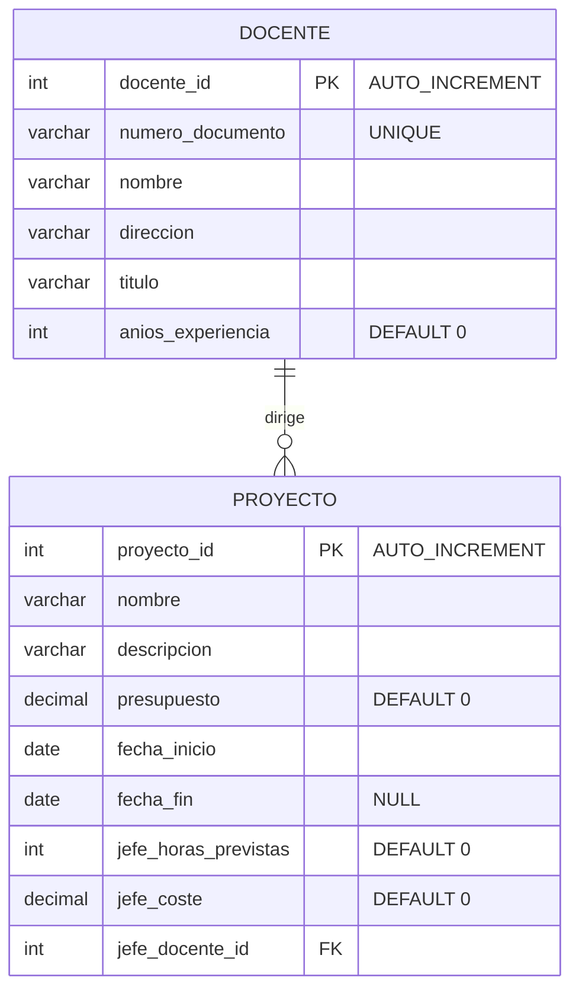

# Diagrama lógico (Mermaid)

```mermaid
erDiagram
    DOCENTE ||--o{ PROYECTO : "dirige"

    DOCENTE {
        int docente_id PK "AUTO_INCREMENT"
        varchar numero_documento "UNIQUE"
        varchar nombre
        varchar direccion
        varchar titulo
        int anios_experiencia "DEFAULT 0"
    }

    PROYECTO {
        int proyecto_id PK "AUTO_INCREMENT"
        varchar nombre
        varchar descripcion
        decimal presupuesto "DEFAULT 0"
        date fecha_inicio
        date fecha_fin "NULL"
        int jefe_horas_previstas "DEFAULT 0"
        decimal jefe_coste "DEFAULT 0"
        int jefe_docente_id FK
    }
```
