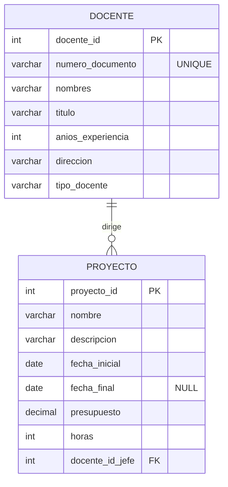

# Diagrama lógico (Mermaid)

```mermaid
erDiagram
  DOCENTE ||--o{ PROYECTO : "dirige"
  DOCENTE {
    int docente_id PK
    varchar numero_documento "UNIQUE"
    varchar nombres
    varchar titulo
    int anios_experiencia
    varchar direccion
    varchar tipo_docente
  }
  PROYECTO {
    int proyecto_id PK
    varchar nombre
    varchar descripcion
    date fecha_inicial
    date fecha_final "NULL"
    decimal presupuesto
    int horas
    int docente_id_jefe FK
  }
```
